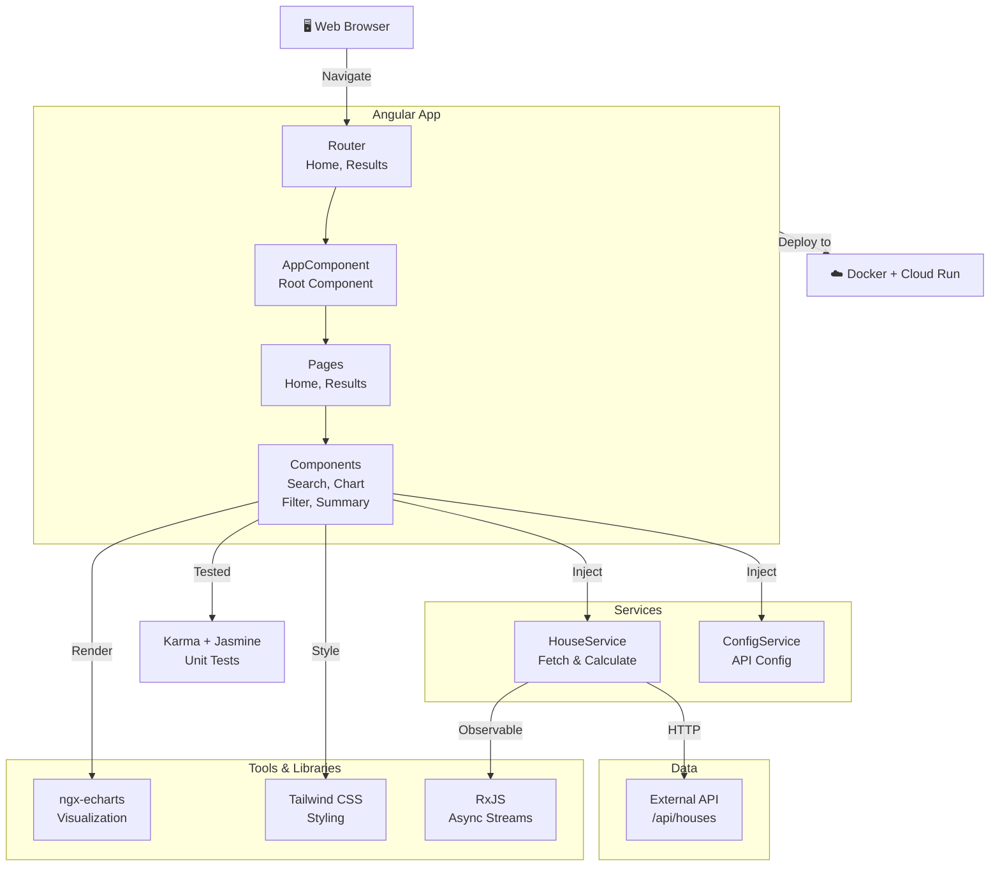

# ngx-Housing Price Lab - Architecture Diagram

## Overview

ngx-Housing Price Lab is an Angular 21 application for analyzing housing prices with filtering and visualization capabilities.

## Architecture Components

### Frontend
- **Router**: Angular routing for Home and Results pages
- **AppComponent**: Standalone root component
- **Pages**: Home and Results page components
- **Components**: Reusable components for search, charts, filters, and summary cards
- **Styling**: Tailwind CSS for responsive design

### Services (Dependency Injection)
- **HouseService**: Handles API calls to fetch houses and calculates statistics (avg, median, min, max)
- **ConfigService**: Manages API endpoint configuration

### Data Layer
- **External API**: Calls to `/api/houses` endpoint with filter parameters

### External Libraries
- **ngx-echarts**: Angular wrapper for ECharts visualization
- **Tailwind CSS**: Utility-first CSS framework
- **RxJS**: Reactive programming with Observables for async operations

### Testing & Quality
- **Karma**: Test runner
- **Jasmine**: Testing framework

### Infrastructure
- **Docker**: Containerization
- **Google Cloud Run**: Serverless deployment
