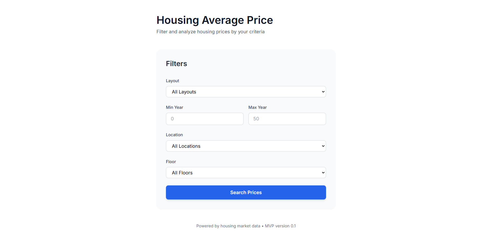
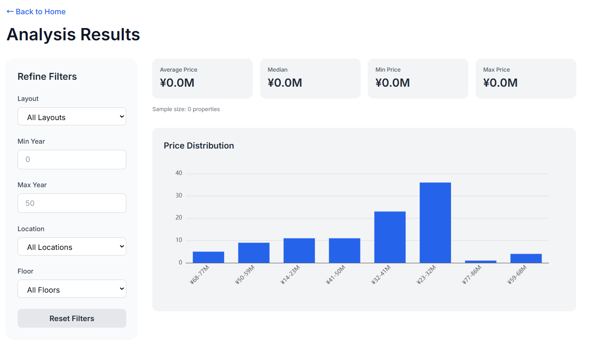

# Demo: Housing Price Analysis
An Angular frontend application for analyzing housing prices, featuring filtering and visualization powered by ECharts. The backend is a Next.js project (housing-price-lab repository).

Running at https://ngx-housing-price-lab-2w7oequsua-an.a.run.app/

A full‑stack Angular web application that visualizes housing price trends across Japan.  
This project demonstrates enterprise‑grade frontend development, modular architecture, cloud deployment, and Infrastructure as Code using Terraform.

Live Demo:  
https://ngx-housing-price-lab-2w7oequsua-an.a.run.app/

---

## 🚀 Features

- Interactive housing price dashboard  
- Prefecture‑level and city‑level filtering  
- Dynamic charts and data visualization  
- Responsive layout with Angular components  
- API‑driven architecture  
- Fully automated deployment to Google Cloud Platform using Terraform

---

## 🛠 Tech Stack

### **Frontend**
- Angular 17  
- TypeScript  
- RxJS  
- Angular Material  
- Chart.js  

### **Infrastructure / DevOps**
- Terraform (Infrastructure as Code)  
- Google Cloud Run  
- Google Artifact Registry  
- Google Cloud Build  
- Google Cloud Storage  
- CI/CD pipeline  

---

## 🧱 Architecture Overview
User → Angular App → API Layer → Housing Price Dataset
↓
Deployed via
Terraform → GCP (Cloud Run)


This architecture provides:
- Strong separation of concerns  
- Scalable and maintainable code structure  
- Production‑ready cloud deployment  
- Reproducible infrastructure via Terraform  

---

## 🌐 Live Deployment

The application is deployed on **Google Cloud Run**, with all infrastructure defined and managed through **Terraform**.

- **Frontend**: Angular app containerized and deployed to Cloud Run  
- **Infrastructure**: Provisioned via Terraform modules  
- **Build & Deploy**: Automated using Cloud Build  

This mirrors a modern enterprise deployment workflow.

---

## 📂 Project Structure
```
ngx-housing-price-lab/
├── infra/                   # IaC for GCP deployment 
├── src/ 
│    └── app/ 
│        ├── components/     # UI components
│        ├── pages/          # Page-level views 
│        ├── services/       # API and data services 
│        └── models/         # TypeScript interfaces 
└── Dockerfile               # Container build
```


---

## 📊 Screenshots




---

## 🧪 Local Development

```bash
npm install
npm start
```

App runs at:
http://localhost:4200

## ☁️ Deployment (Terraform + GCP)
GitHub Action build and deploys generated files to GCP. Please refer under .github/workflows/deploy.yml for the steps.

The GCP configuration is under infra/terraform


## 🎯 What This Project Demonstrates
This repository highlights capabilities relevant to enterprise‑level Angular development and cloud‑native applications:
• 	Angular 17 architecture and best practices
• 	Component‑based UI design
• 	Reactive programming with RxJS
• 	Data visualization and dashboard UI
• 	Cloud‑native deployment (GCP + Cloud Run)
• 	Infrastructure as Code (Terraform)
• 	CI/CD automation
• 	Production‑ready containerized workflow
If you need a developer experienced in Angular dashboards, admin panels, analytics tools, or cloud‑deployed web apps, this project reflects that skill set.

## 📬 Contact
For collaboration or custom dashboard / web application development:

Email: yoshiyuki.takahashi.jp@gmail.com

GitHub: https://github.com/y16i
